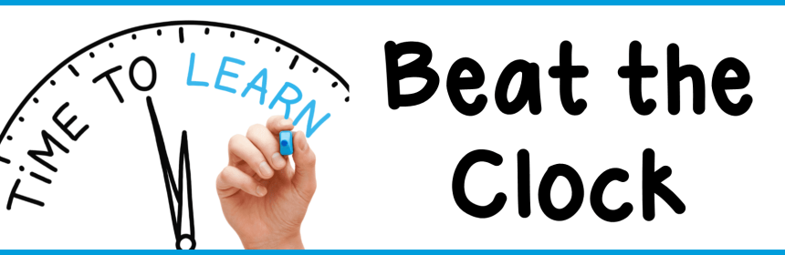

# Beat the Clock Quiz

A quick JavaScript quiz game built with HTML, CSS, and JavaScript.

## Project Preview

## Features

- Multiple-choice quiz questions
- Countdown timer for each question
- Score tracking
- Restartable game flow
- Shuffled answer options

## How to Run

1. Open the project folder.
2. Open `index.html` in a browser.
3. Click the Start Quiz button to begin.

## Files Included

- `index.html`
- `style.css`
- `script.js`
- `questions.json`
- `img/`
